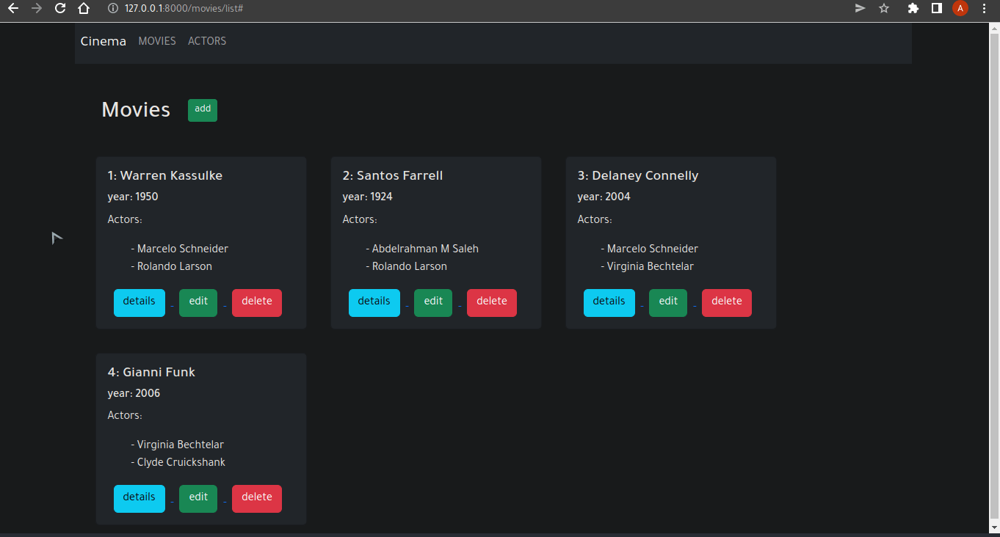

# Django crud with postgres

### getting started

- first edit [settings template file](DjangoCrud/settings.template.py), 
    add your db connection and secret django key

- run with ```pthon manage.py runserver```

### gif
